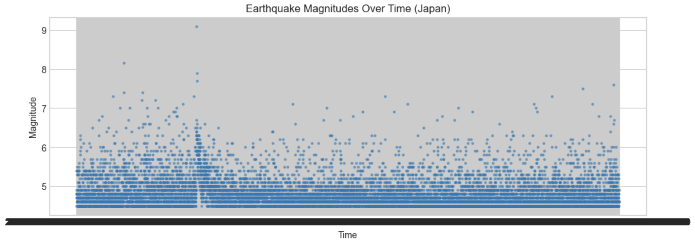
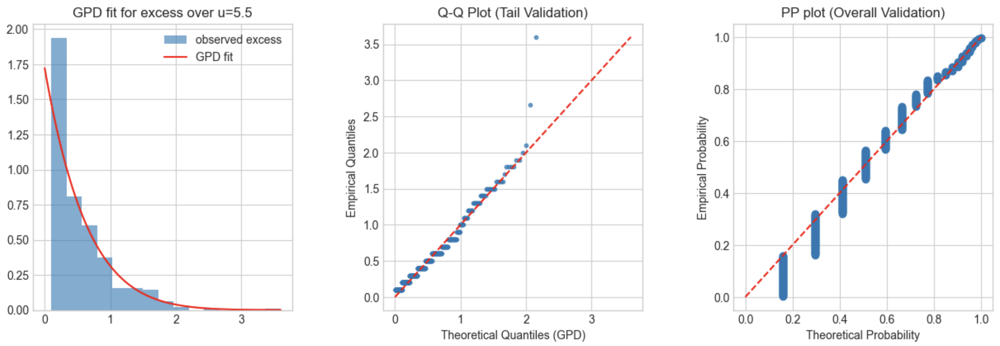
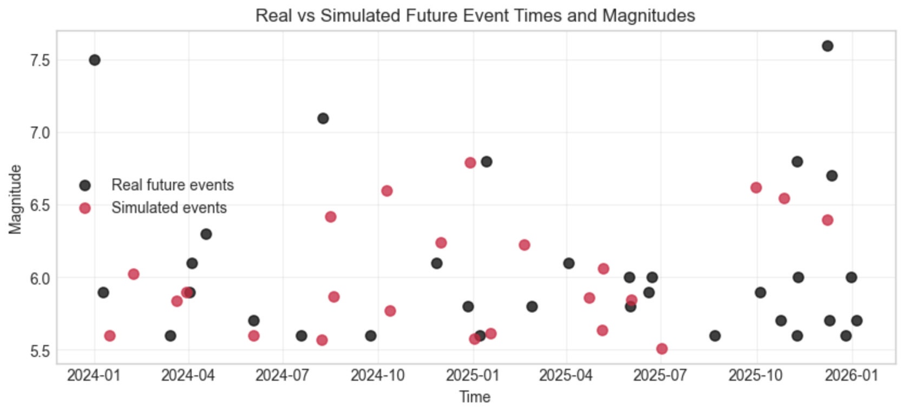
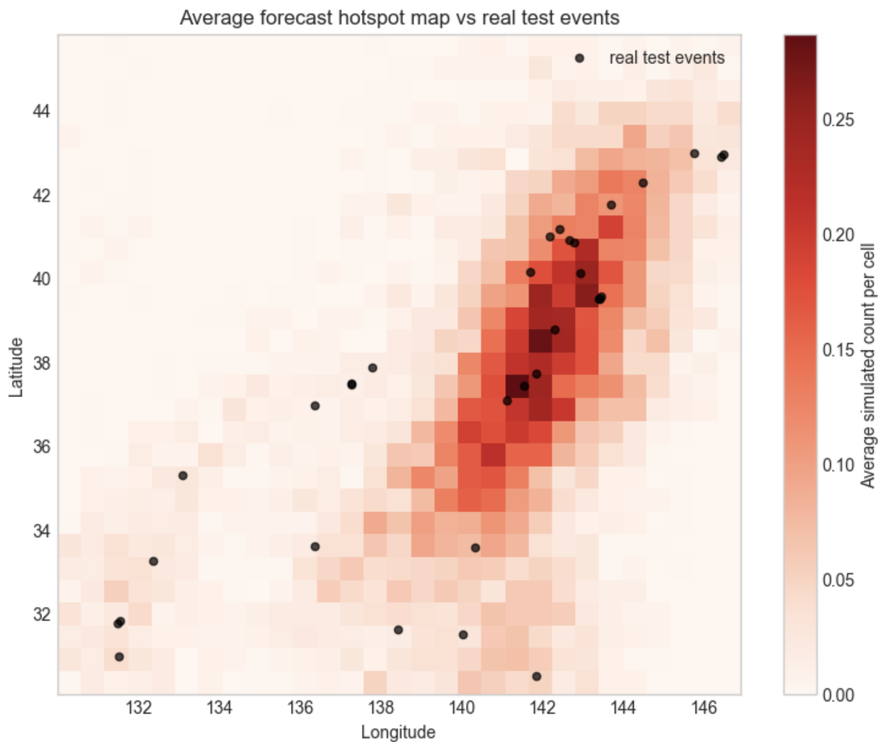

# Japan Earthquake Risk Analysis with EVT and Hawkes Processes

Statistical analysis of extreme earthquake risk in Japan using **Extreme Value
Theory (EVT)**, **Hawkes processes**, spatial kernel density estimation, and
Monte Carlo simulation.

The study uses earthquakes of magnitude 4.5 or higher recorded around Japan
between January 2000 and February 2026. The data come from the
[USGS Earthquake Catalog](https://earthquake.usgs.gov/earthquakes/search/).

## Overview

The project answers three related questions:

1. How can the tail of earthquake magnitudes be modelled?
2. Do extreme earthquakes exhibit temporal and spatial clustering?
3. Can time, location, and magnitude be combined in a probabilistic simulator?

The final framework contains three layers:

```text
Hawkes process (time)
        +
Spatial KDE (location)
        +
Conditional GPD (magnitude)
        -> Monte Carlo earthquake scenarios
```

## Data and Preprocessing

- Region: Japan, 30-46 degrees N and 130-150 degrees E
- Period: 2000-01-01 to 2026-02-26
- Minimum magnitude: 4.5
- Cleaned catalog: 11,333 events
- Declustering: retain the largest event in each 24-hour window
- Declustered catalog: 3,776 events



## Extreme Value Analysis

The **Peaks Over Threshold (POT)** approach is used to model large earthquake
magnitudes. Mean-excess and parameter-stability diagnostics support the
threshold

\[
u = 5.5.
\]

The 413 threshold exceedances are fitted with a Generalized Pareto Distribution
by maximum likelihood:

\[
\hat{\xi}=-0.099, \qquad \hat{\sigma}=0.581.
\]

The estimated return levels are:

| Return period | Magnitude |
|---:|---:|
| 10 years | 7.81 |
| 20 years | 8.06 |
| 50 years | 8.37 |
| 100 years | 8.59 |



## Spatio-Temporal Model

An exponential Hawkes process captures short-term temporal clustering. Maximum
likelihood estimation on the training exceedances gives:

\[
\hat{\mu}=0.0242, \qquad
\hat{\alpha}=0.0155, \qquad
\hat{\beta}=0.0339.
\]

Because \(\hat{\alpha}/\hat{\beta}<1\), the fitted process is stable. Event
locations are modelled with a two-dimensional KDE, while a conditional GPD
models magnitude using time, latitude, and longitude.

## Monte Carlo Forecasting

The three layers are combined to simulate complete future earthquake paths.
Across 300 Monte Carlo simulations, the holdout observations remain within the
main predictive ranges:

| Quantity | Observed | Simulated mean | 5%-95% interval |
|---|---:|---:|---:|
| Event count | 32 | 26.47 | 14.00-44.00 |
| Maximum magnitude | 7.60 | 7.07 | 6.48-7.86 |
| Mean magnitude | 6.07 | 5.96 | 5.81-6.12 |

<p align="center">
  
  
</p>

## Repository Structure

```text
.
├── data/
│   ├── raw/          # Original USGS catalog
│   └── processed/    # Cleaned and declustered data
├── figures/          # Statistical diagnostics and forecast figures
├── notebooks/        # Complete analysis and simulation workflow
├── report/           # Full written report
├── requirements.txt
└── README.md
```

- [Analysis notebook](notebooks/japan_earthquake_evt_hawkes.ipynb)
- [Full report](report/earthquake_risk_evt_hawkes_report.pdf)

## Running the Analysis

```bash
pip install -r requirements.txt
cd notebooks
jupyter notebook japan_earthquake_evt_hawkes.ipynb
```

The processed datasets are included, so the analysis can be resumed from the
cleaning, declustering, EVT, Hawkes, or simulation stages.

## Main Tools

- Python
- NumPy and pandas
- SciPy
- Matplotlib
- Jupyter Notebook

## Data Source

United States Geological Survey,
[Earthquake Catalog](https://earthquake.usgs.gov/earthquakes/search/).

